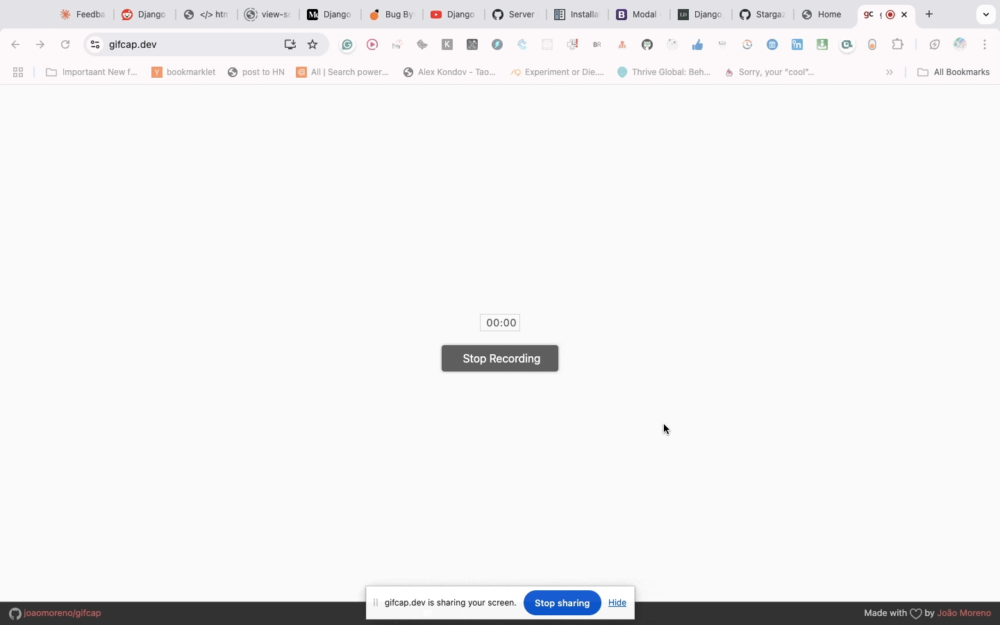

# Amazon Seller Returns ( Using Django With HTMX )

# Architecture

amazon-seller-returns/
│
├── app/
│   ├── orders/
│   │   ├── models.py      # Order models
│   │   ├── views.py       # Order-related views
│   │   └── forms.py       # Order forms
│   │
│   ├── disputes/
│   │   ├── models.py      # Dispute Case model
│   │   ├── views.py       # Dispute management views
│   │   └── forms.py       # Dispute case forms
│   │
│   │── returns/
│   │   ├── models.py      # Return Case model
│   │   ├── views.py       # Return management views
│   │   └── forms.py       # Return case forms
    │   
│   └── core/
│       ├── settings.py    # Django settings
│       └── urls.py        # Main URL routing
│
├── templates/             # HTML templates
│   ├── base.html
│   ├── orders/
│   ├── returns/
│   └── disputes/
│
├── Dockerfile
├── docker-compose.yml
└── requirements.txt

## Getting Started

Setup using the Dockerfile and docker-compose.yml

- Install Docker and Docker Compose on your machine.
- Clone this repository to your local machine.
- Navigate to the project directory.

- Run the following command to build and start the Docker containers:
    docker-compose up -d --build
    docker-compose exec web python manage.py migrate

- Access the application in your web browser at http://localhost:8000

